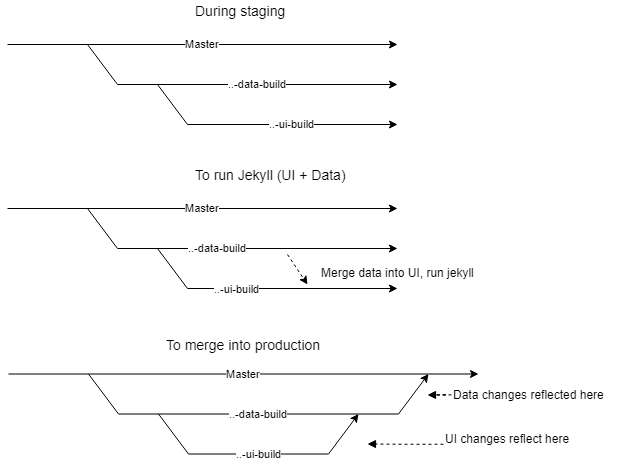

Set up dev env
--------------

### Frontend only

```
npm install
bundle install
```

### Regenerating data files

Create a python 2 virtual environment, e.g. with `virtualenv2 env`

Activate it and install python dependencies

```
source env/bin/activate
pip install -r requirements.txt
```

Development
-----------

### Following changes to JS or CSS

```
npm run build
```

Note that it's a good idea to make sure your branch's generated assets are up to date with master before deploying merging your pull request:

```
git fetch
git merge origin/master # ignore conflicts on assets/* or _data/assets.json
rm -r assets/generated/* _data/assets.json
npm run build
```

Then stage the changes and commit as you would normally for a merge.

Be sure to run Jekyll and have a quick look whether things look and work right.

### Run a local server to view the site
Install Jekyll, then serve the site with

```
bundle exec jekyll serve --watch
```

Regenerating the site can take over a minute on a typical dev machine. 
You can speed it up by working on a subset of the site data. 
We delete a bunch of the routing files and tell git to ignore those changes in your local repository using 
`git update-index --assume-unchanged`. 
This means only national departments and departments from Mpumalanga and the Eastern Cape will exist,
 bringing regeneration time down to about 10s.

```
git ls-files|grep provincial|egrep -v '(mpumalanga|eastern-cape)' | grep html | tr '\n' ' ' | xargs git update-index --assume-unchanged
git ls-files|grep provincial|egrep -v '(mpumalanga|eastern-cape)' | grep html | tr '\n' ' ' | xargs rm
```

To remove `assume-unchanged` from all files with that currently configured:

```
git ls-files -v|grep '^h'| sed 's/^h//' | xargs git update-index --no-assume-unchanged
```

## Data generation

The static-budget-portal is the front-end (static site) of Vulekamali and does not generate or retrieve data.

The static-budget-portal requests data from the [Data Manager](https://github.com/OpenUpSA/budget-portal) 
and stores it locally in the `_data` directory, which it then uses to build the static site via Jekyll.

That means the actual data being served in production is managed by Git.
Production data exists in the `master` branch of static-budget-portal.

The static-budget-portal can be pointed towards any one of the following Data Manager states:
1) Local (development)
2) Staging 
3) Production


The generated data will differ, depending on the code running in whichever Data Manager state you are building against.


### Local (development)

You will need to run a local Data Manager instance for this to work.

Please see instructions for [Data Manager](https://github.com/OpenUpSA/budget-portal) in order to set that app up.

After you've completed the setup for Data Manager, you can continue reading.

Set your PORTAL_URL environment variable to point to your local app:
```
export PORTAL_URL=http://localhost:8000/ 
python generate/from_dynamic.py
```

Generate data for each department and each financial year with the following:

```
source env/bin/activate
python generate/from_dynamic.py
```


Then use `git status` and `git diff` to get an idea of what changed. 
If it looks sensible, add the updated files and commit and PR back into the branch where you want changes reflected.

When modifying the Dynamic Budget Portal server, you might want to point to your development server:

You can update one file at a time as follows:
```
curl -o _data/2016-17/national/departments/planning-monitoring-and-evaluation.yaml https://dynamicbudgetportal.openup.org.za/2016-17/national/departments/planning-monitoring-and-evaluation.yaml
```

### Travis CI (staging/production)

[Travis CI](https://travis-ci.org) is used to build page data for staging or production.

Every branch push results in a Travis CI build, but by default it won't regenerate data files.

Add `[ci]` to the commit message of the latest commit in the pushed branch to opt into generating data files.

Add `[staging]` to that commit message  to use the staging web data server instead of production. 
This is useful if we want to see what the data will look like for a development branch of the web data server.

If any files changed, Travis CI will add and commit the changes and push that back to the branch. 
That means you'll need to pull the branch and perhaps use `pull --rebase` if you've since committed other changes. 
***Don't trust the changes because it was a robot - check that the site works as expected and the diff looks reasonable 
before merging your PR***

Best practise is to place these tags as the first part of the first line of the commit message. 
This makes it easy to see whether staging or production was used in the pull request list of commits.

To create a commit without any code changes to trigger a build, use `--allow-empty`. e.g.

```bash
git commit -m "[ci][staging] trigger data regeneration for new department xyz data" --allow-empty
```

#### Staging workflow



- Checkout a new `..-data-build` branch (this branch must only contain `_data/` changes)
- Checkout a new `..-ui-build` branch from the new `data-build` branch (this branch must only contain JS, HTML, CSS etc. changes)
- Switch back to the `..-data-build` branch
- Commit this new `..-data-build` branch with `[ci][staging] <message>`, if empty then include parameter `--allow-empty` 
- Push this new commit to origin
- Check [Travis CI](https://travis-ci.org) to see the status of the build and if there are any errors
- When Travis has completed, pull the branch (`..-data-build`) again to fetch the new data Travis built
for us
- Merge `..-data-build` into `..-ui-build`
- Serve the site locally using Jekyll to confirm that the data generated by travis during staging is correct, and that
the front-end renders correctly.
- If all is well, you should be clear to produce and deploy production data.

#### Deploy to production

Before deploying to production, ensure you've been through the Staging workflow described above.

- Checkout the existing `..-data-build` branch you've been working with
- Commit this branch to origin with `[ci]` (no staging) to build data against production
- If you've had any additional UI changes, follow step 7 from "Staging workflow"
- If all is well, open a pull request on Github to merge `..-ui-build` into `..-data-build`
    - In theory this PR should only show code changes to the UI
    - This PR should include screenshots of a local Jekyll server with the latest code/data, of the specific changes made
- Open a Github PR to merge `..-data-build` into `master` 
    - This will kick off a Travis CI job, but it will not build the site (should last ~30 sec)
    


Architecture
--------------

### Front-end

Front-end files are structured according to [SUIT CSS principles](https://github.com/suitcss/suit/blob/master/doc/README.md) - an approach developed by Twitter, BBC Three, Cloud Four and Segment.

In short, SUIT CSS is a component-based system that _'allows for the implementation and composition of loosely coupled, independent [User Interface] units into well-defined composite objects'_.

The above SUIT CSS principles is implemented into our underlying Jekyll structure by grouping all front-end styling/behaviour resources into the root `_includes` folder as one of two sub-folders: `components` and `utilities`:

- **Utilities** influence the entire front-end on  a global scale. For example, either as the styling of all `<a>` tags, helper scripts used by all components or as polyfills for features not supported on older browsers.
- **Components** are a variety of files (`.js`, `.scss`, `.html`) scoped to specific UI units. As per SUIT CSS convention, these files are encapsulated by a certain section of the DOM. For example, all behaviour/styling in the `Tooltip` folder will only correspond to the DOM fragment inside a parent DOM Node with the `Tooltip` class.


Testing
--------------

### Front-end Regression Testing
Note: It is important that you are connected to the internet and that you have a `localhost:4000` instance of the site running. These tests will compare the UI of the live site against your current `localhost:4000` instance.

Before starting a new testing session run `npm run test:setup`. This will take screenshots of the live site and save it as NPG images in the `backstop_data` folder. Remember that these will be used for comparison, so if the live site is changed in some way please re-run this command.

Once these PNG images are downloaded run `npm run test` to compare your UI at `localhost:4000` against them. Once the tests are finished you will get a results screen showing differences between your two sources. Given that you are probably making changes to the UI, you will get a couple of errors where it differs.

If you are happy with the changes (and did not see any unforeseen side-effects) you can run `npm run test:approve`. This will update your reference PNG images with your current UI state (Note that if you run `npm run test:setup` it will replace these with screenshots of the live site).

All tests are respectively ran at the following four viewport sizes:
- 320 x 480
- 568 x 1024
- 1024 x 758
- 1920 x 1080

Broadly speaking they currently cover the following states:
- All current pages as loaded without any user interaction, included their variations when passed URL parameters.